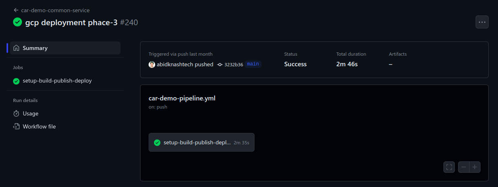

# CI/CD Pipeline for GCP

## Overview

This repository houses the Continuous Integration and Deployment (CI/CD) pipeline for our project hosted on the Google Cloud Platform (GCP). The CI/CD pipeline streamlines the tasks of testing, constructing, and deploying our application automatically whenever modifications are applied to the primary branch.

## Secrets

The pipeline utilizes certain secrets to securely authenticate and authorize access during the workflow. Make sure to configure the following secrets in your GitHub repository:

- `GKE_PROJECT`: Google Cloud Project ID for GKE deployment.
- `GKE_KEY`: JSON key file for authenticating with the GCP service account.
- `REGION`: The region in which the GKE cluster is deployed.
- `GKE_CLUSTER`: The name of the GKE cluster.
- `GITHUB_TOKEN`: GitHub token for authentication during the workflow.

## Workflow

### Triggering the Pipeline

The CI/CD pipeline ([car-demo-pipeline.yml](.github/workflows/car-demo-pipeline.yml)) is triggered automatically when code changes are merged into the main branch. This ensures that the latest changes are validated and deployed in a systematic manner.

### Pipeline Execution

1. **Code Merge:**
    - When code changes are merged into the main branch, the CI/CD pipeline is automatically initiated.

2. **Testing:**
    - The pipeline begins by running a series of tests to ensure the code integrity.
    - It verifies that the code adheres to coding standards and passes unit tests.

3. **Build Process:**
    - Upon successful testing, the pipeline proceeds to the build phase.
    - The build process compiles the code, resolves dependencies, and generates artifacts.

4. **Deployment:**
    - The crucial step is the deployment phase.
    - The pipeline ensures that the build is successful, and all tests pass before deploying to Google Kubernetes Engine (GKE).

### Deployment to GKE

- **GKE Deployment:**
    - If the build is successful and all checks pass, the application is deployed to the Google Kubernetes Engine (GKE).
    - The deployment to GKE ensures that the latest version of the application is running in the production environment.

## Status Checks

- **Build Status:**
    - The CI/CD pipeline checks that the build is successful before proceeding to deployment.
    - A green build indicates a successful compilation and testing process. 
    - Example:
  

- **Deployment Status:**
    - The deployment phase is executed only if the build is successful.
    - A successful deployment ensures that the application is running in the GKE cluster.

The CI/CD pipeline will automatically handle the testing and deployment processes once your changes are merged into the main branch.

