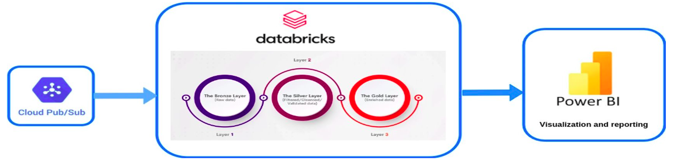
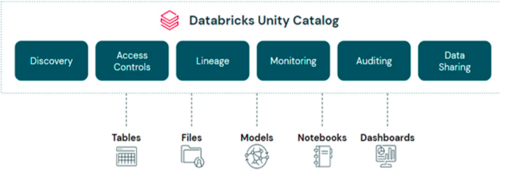
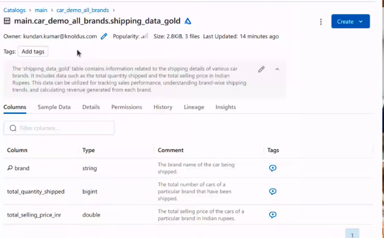
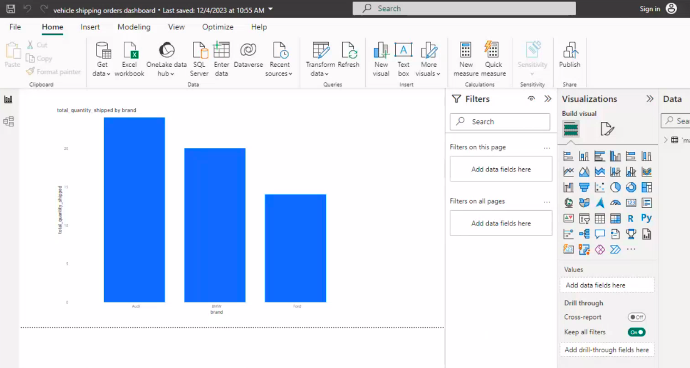
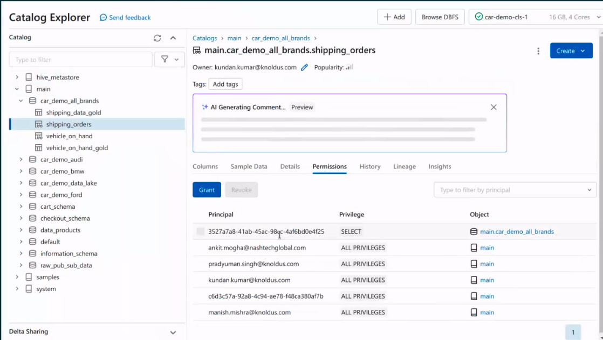

# Car demo data infrastructure and analytics

For the analytical purpose, the insightful data generated by microservices brings to the databricks
Lakehouse platform.

The Microservices publish data to pubsub topics. The streaming data pipeline, which basically receive the streaming event from 
cloud pubsub and writing to the several databricks Delta Lake table. There is a medallion architecture while creating the pipeline.
There is a bronze table for keeping the raw data. From the raw data we are doing some basic transformations.
Basically doing the encryption for the PII columns, then writing to the Silver Table and from the Silver Table we are doing some aggregation.
and writing  aggregated result to the Golden Table and this golden table we are using for creating the visualization and reporting.



There is a streaming pipeline([PubSub-shipping-ingestion.py](PubSub-shipping-ingestion.py)) created with spark structured streaming to read shipment events from pubsub topic
and write it to different delta lake tables.

### Prerequisite
1. Databricks workspace created with data plane resides on GCP account running the gcp pubsub and other services.
 follow the ([document](https://docs.gcp.databricks.com/en/administration-guide/workspace/create-workspace.html)) to create workspace on GCP
2. Create a [Unity Catalog metastore](https://docs.gcp.databricks.com/en/data-governance/unity-catalog/create-metastore.html)
   Note: Unity Catalog provides centralized access control, auditing, and data discovery capabilities across Databricks workspaces.
   so Unity catalog is using for data governance.
  
3. All the microservices deployed on GKE and publishing event to pubsub topic. the streaming pipeline([PubSub-shipping-ingestion.py](PubSub-shipping-ingestion.py))
   read events from topic shipping-notification and subscription. so topic and subscription should be created.
4. To connect databricks to gcp pubsub will be needed gcp credentials. The credential should be stores in 
   ```databricks workspace. Follow this [document](https://docs.gcp.databricks.com/en/security/secrets/secret-scopes.html) to keep secrets in secrets. Following credential to be keep in secret scope.
   client_id_secret = dbutils.secrets.get(scope = "gcp-pubsub", key = "client_id")
   client_email_secret = dbutils.secrets.get(scope = "gcp-pubsub", key = "client_email")
   private_key_secret = dbutils.secrets.get(scope = "gcp-pubsub", key = "private_key")
   private_key_id_secret = dbutils.secrets.get(scope = "gcp-pubsub", key = "private_key_id")
   ```
   pick these secrets from gcp service account json key.
5. Create a small size [compute cluster](https://docs.gcp.databricks.com/en/compute/configure.html) on data bricks.
6. For Visualization, Install power BI desktop on your machine.
   To connect Power BI desktop to databricks cluster follow - [document](https://docs.gcp.databricks.com/en/partners/bi/power-bi.html)

### How to run
1. Import this ([PubSub-shipping-ingestion.py](PubSub-shipping-ingestion.py)) this file to databricks notebook
   follow [document](https://docs.gcp.databricks.com/en/notebooks/notebook-export-import.html#import-a-notebook) to import
2. [Attach](https://docs.gcp.databricks.com/en/notebooks/notebook-ui.html#attach) a cluster created to the notebook.
3. [Run](https://docs.gcp.databricks.com/en/notebooks/run-notebook.html) the notebook.

### Result

The pipeline will crete three table in unity catalog -
a) main.car_demo_data_lake.shipping_bronze
b) main.car_demo_data_lake.shipping_sliver
c) main.car_demo_all_brands.shipping_data_gold

Note: these delta lake tables Creates automatically.



This gold table connects to powerBI desktop for the visualization


#### Data governance
All data assets tables ,view, databases stores in unity catalog. So, Grant and revoke of permission to a user 
and service principle will be executed on databricks unity catalog. Data discovery will be done on unity catalog.



